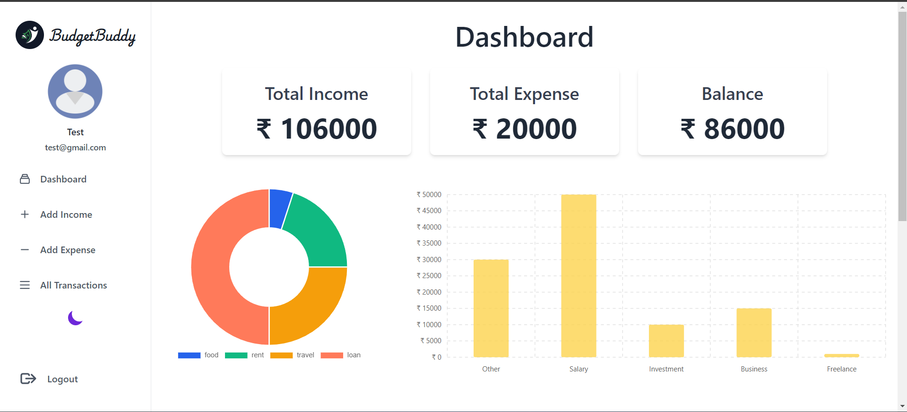
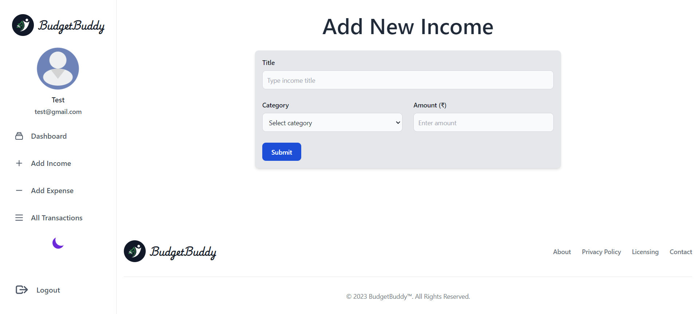
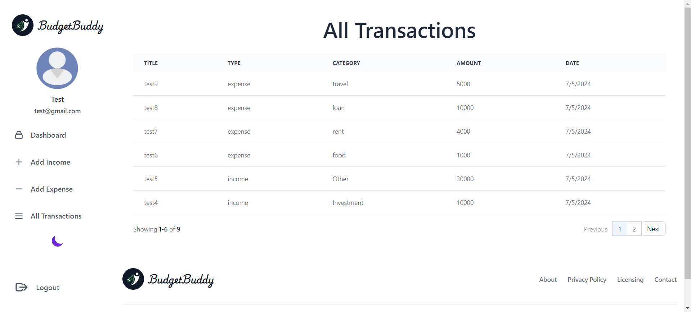

# BudgetBuddy

BudgetBuddy is a budget tracking app that helps you manage your finances effectively. You can add income and expenses, view category-wise expenses in a donut chart, see category-wise income in a bar graph, and view all transactions. It also shows your total income, total expenses, and balance.

## Features

- Add income and expenses
- View category-wise expenses in a donut chart
- View category-wise income in a bar graph
- View all transactions
- Display total income, total expenses, and balance

## Screenshots

### Dashboard


### Add Income



### All Transactions



## Technologies Used

- **Frontend:**
  - React (with Vite)
  - Tailwind CSS
- **Backend:**
  - Node.js
  - Express
- **Database:**
  - MongoDB

## Getting Started

### Prerequisites

Make sure you have the following installed:

- Node.js
- npm
- MongoDB

### Installation

1. Clone the repository:
   ```sh
   https://github.com/VedantJ28/BudgetBudddy.git

2. Install dependencies for both the client and server.

### Running the fronend
1. Navigate to the client directory:
    ```sh
    cd client

2. Install dependencies:
    ```sh
    npm i

3. Start the development server:
    ```sh
    npm run dev

### Running the backend
1. Navigate to the server directory:
    ```sh
    cd server

2. Install dependencies:
    ```sh
    npm i

3. Create a .env file in the server directory with the following content:
    ```sh
    PORT=your_port_number
    MONGODB_URL=your_mongodb_connection_string
    JWT_KEY=your_jwt_secret_key

4. Start the development server:
    ```sh
    npm start

## Usage
Once both the frontend and backend servers are running, you can start using BudgetBuddy by navigating to the frontend URL provided by Vite. You can then begin adding your income and expenses, and view your budget insights.

# Happy budgeting with BudgetBuddy!

